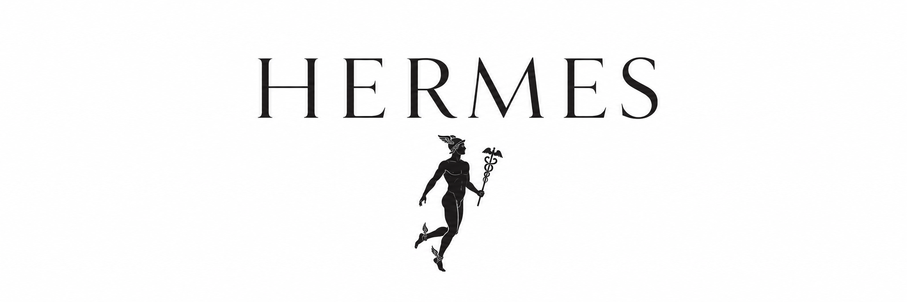
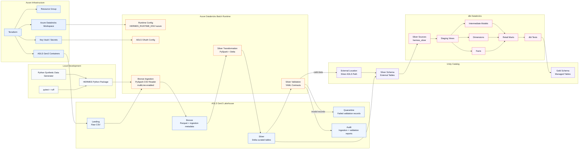

# HERMES

**HERMES** is a data engineering project intended to simulate a cloud data modernisation initiative for a ficticious omnichannel retail organisation.

This project demonstrates batch processing using Azure, Databricks, PySpark, Spark SQL, Delta Lake, and Kafka compatible streaming. A streaming pipeline is intended in future.

---

## The Purpose of HERMES

This project is designed in such a way to show practical working knowledge and capacity across the following:

- Azure data engineering
- Development using Databricks and PySpark
- Constructing Delta Lake medallion datalake architectures
- Batch data ingestion and orchestration
- Kafka compatible event streaming
- Data modelling in the retail industry context
- Analytics engineering using dbt gold layer data marts
- Ensurance of data quality and governance
- CI/CD and industry standard engineering standards
- Cloud infrastructure as code (IaC) using Terraform
- Appropriate documentation, ADRs, runbooks, and delivery planning

---

## The Scenario 

For HERMES I specifically wanted to apply data engineering principles in the context of a retail business.

The underlying context of these works are as follows.

I am assuming the role of a data engineer working underneath a fictional omnichannel retailer.

The retailed intends to modernise legacy data infrastructure. This includes modernising fragmented batch reporting and delayed operational extracts into a scalable lakehouse platform.

This platform supports the proceeding:

- Sales analytics,
- Inventory monitoring
- Customer behavioural analysis
- Promotion performance reporting
- (Near) real-time KPIs
- Governed data marts prepared for business intelligence needs

---


## Project Status

**COMPLETED:**

- Synthetic retail data generation across multiple retail channels
- Local batch pipeline prototype 
- Provisioned Azure infrastructure with Terraform
- ADLS Gen2 medallion data lakehouse containers
- Azure Databricks batch pipeline execution
- Bronze data ingestion using PySpark
- Silver Delta table transformation
- YAML data contracts (packaged with the python project to Databricks)
- Silver validation and quarantine with audit reporting
- Unity Catalog external silver table registration
- dbt connection to Azure Databricks
- dbt Gold layer dimensional models, fact tables, and data marts

**LATER OBJECTIVES:**

- Streaming data ingestion
- Kafka / Event Hubs / Auto Loader
- Construction of structured streaming pipeline
- Databricks workflow or Azure Data Factor orchestration
- Externalisation of gold later to ADLS gold container (current Unity Catalog tables)
- Finalization of project, cost optimisation, data governance hardening


---

## Architecture




---

## Stack

- Programming / Query languages: **Python, SQL**
- Big data processing: **PySpark**
- Lakehouse storage: **ADLS Gen2, Delta Lake, Parquet**
- Cloud platform: **Microsoft Azure**
- Compute: **Azure Databricks clusters / SQL warehouse**
- Infrastructure: **Terraform**
- Data quality: **YAML contracts, PySpark validation, dbt tests**
- Governance: **Unity Catalog**
- Analytics engineering: **dbt Databricks**
- Testing: **pytest, dbt tests**
- Formatting: **ruff**

---

## Data Models

Project HERMES models a synthetic retail businesses with a multitude of difference source data entities:

- Customers
- Stores
- Products
- Order Items
- Orders
- Inventory Snapshots
- Promotions

The dbt gold layer produces staging models, dimension and fact tables, intermediate models, and retail / KPI data marts.

### Silver Tables

The Silver tables are registered under Unity Catalog by defining the ADLS Gen2 silver layer containing the silver Delta tables as an external location.

The registered silver tables are under `dbw_hermes_dev_9s5nbox.silver`.

### Gold Models

The gold models were built with dbt and exist as Unity Catalog tables under `dbw_hermes_dev_9s5nbox.gold`.

The gold models include:

```txt
stg_customers
stg_stores
stg_products
stg_orders
stg_order_items
stg_inventory_snapshots
stg_promotions

dim_customer
dim_product
dim_stores

fct_sales
fct_inventory_snapshot

int_order_revenue
int_inventory_position
int_promotion_attribution

mart_daily_retail_kpis
mart_promotion_performance
```

---

## Medallion Layers

### Landing

The landing layer contains the raw CSV files uploaded to ADLS Gen2. These CSV files represent the legacy retail data. 

### Bronze

The bronze layer stores the ingested source data from the landing layer with the addition of metadata columns including:

- `_bronze_source_name`
- `_bronze_source_file`
- `_bronze_source_path`
- `_bronze_ingested_at`
- `_bronze_ingestion_date`

The Azure bronze ingestion uses Spark CSV reading with multiline support to correctly handle multiple line fields such as customer addresses.

### Silver

The silver layer contains the cleaned and standardised Delta tables.

The data cleaning involved: explecity typing, standardised naming, deduplication of records, cleaned business entities, and consistent schemas for downstream validation and data modelling.

### Gold

The gold layer was built with dbt on Databricks for a stronger governance and analytics engineering element to the project.

The gold layer reponsibilities included: 

- Staging views over Unity Catalog Silver sources
- Dimensional models
- Fact models
- Intermediate models for revenue, inventory and promotions
- Business intelligence prepared retail marts and KPIs
- dbt testing and documentation (such as lineage graphs)

---

## Data Quality

HERMES uses two complimentary data validation layers in silver and gold.

### Silver Validation

This is the first validation layer that uses custom YAML data contracts, and performs the validation using PySpark.

The YAML contracts define data quality rules such as:

- Enforcement of values to be present (not null)
- Uniqueness of column values
- Particular regex pattern enforcement
- Accepted value definitions 
- Numeric rules
- Table relationship checks

For example, a customer identification values must match the expected ID format, order identifiers must be unique, order status must be one of the accepted values, and foreign key relationship must hold between orders and customers.

Invalid records that fail the data contract rules are written to a quarantine layer. Furthermore, validation reports are written to an audit layer in ADLS Gen2.

### Gold Validation

For the gold layer, the secondary layer of validation is accomplished using dbt tests that check data quality rules similar to that of the silver layer.

The combination of the gold and silver validation layers add more trust in data throughout the pipeline.

Silver quality is oriented around validating transformations of the source / bronze ingested data and effectively quarantining invalid records.

Gold quality is more focused on data model integrity, relationships between tables, and analytical correctness, supporting effective analytics engineering.

---

## Quarantine and Audits

When a record fails the silver validation checks, they are written to a dedicated ADLS quarantine path. Audit reports are also written to another dedicated audit ADLS path. This supports validation being observable and debuggable rather than silently dropping or ignoring failed data.

---

## Azure Databricks Deployment

The batch pipeline runs on Azure Databricks and reads / writes ADLS Gen2 using service principle OAuth configuration.

Setting runtime environment variables controls whether the pipeline runs using local paths or Azure paths

```bash
HERMES_RUNTIME_ENV=azure
HERMES_STORAGE_ACCOUNT=<storage_account_name
```

The HERMES pipeline package was imported to Azure Databricks. The Databricks notebook is just a runner for the pipeline that configures runtime (set to azure), configures ADLS OAuth (allowing reads / writes to ADLS Gen2), calls HERMES package functions (that run elements of the batch pipeline), and inspects the results.

The actual pipeline logic and data contracts remain inside the Python package, making it easy to iterate upon locally with prototyping and testing, and reusable.

---

## Note on Gold Storage

The silver tables are registered as external Unity Catalog tables over Delta files in ADLS Gen2.

The gold models are currently materialised bt dbt at Unity Catalog managed tables under `dbw_hermes_dev_9s5nbox.gold`. This means that the gold tables are visible and queryable in Databricks Unity Catalog, but are not present as files in the ADLS gold container.

One of the future enhacement I intend for this project is to materialise gold as external Delta tables in the ADLS gold container.

---

## Local Development

Create and activate the environment:

```bash
conda activate HERMES-env
```

Install the project:

```bash
pip install -e ".[dev,spark,dbt]"
```

Run tests:

```bash
pytest
```

Linting and formatting:

```bash
ruff check . --fix
ruff format .
```

Running full local batch pipeline:

```bash
hermes-run-batch-local
```

---


## dbt Usage

dbt commands are to be executed in the `dbt_hermes` directory.

Install dbt packages with:

```bash
dbt deps
```

Verify Databricks connection is correct:

```bash
dbt debug
```

Parse and compile with:

```bash
dbt parse
dbt compile
```

Run dbt models with:

```bash
dbt run --full-refresh
```

Run dbt tests:

```bash
dbt test
```

Generate documentation with:

```bash
dbt docs generate
dbt docs serve
```

---


## Future Work

The batch pipeline is complete. The next part of the project will be introducing streaming pipelines.

Planned streaming implementation:

- Event Hubs or Kafka source
- Databricks Auto Loader or Structures Streaming
- Streaming bronze ingestion
- Streaming silver transformation
- Checkpointing
- Late arrival data handling
- Streaming data validation 
- Databricks Workflows or Azure Data Factory orchestration

Other improvements planned:

- Materalise gold as external Delta tables in ADLS gold
- CI/CD for Terraform and dbt
- Stricter permissions
- Cost control documentation
- Power BI Dashboard

---
